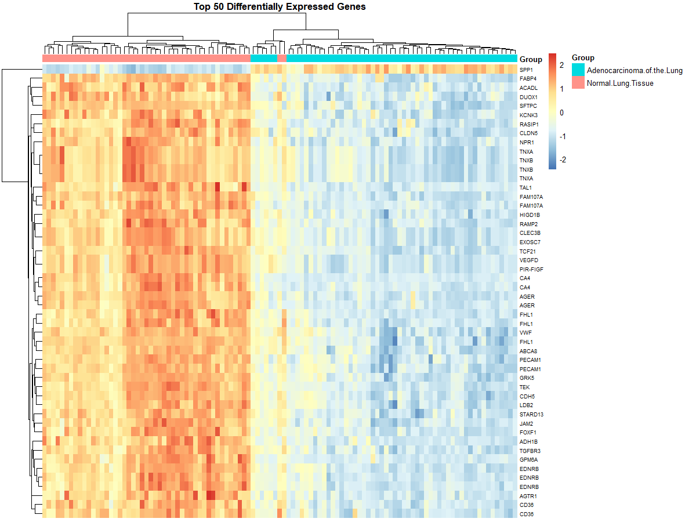
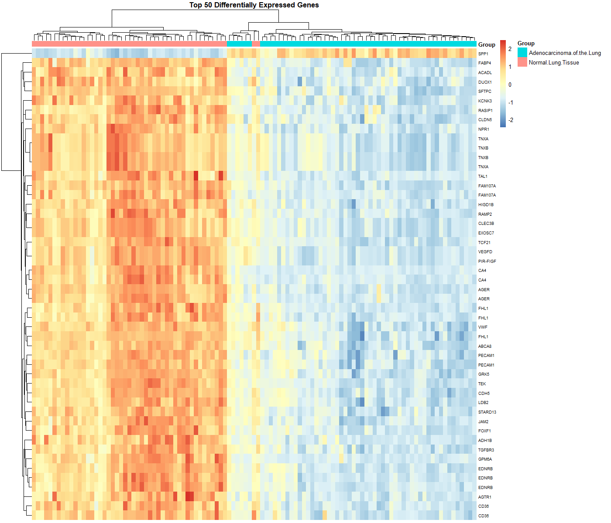
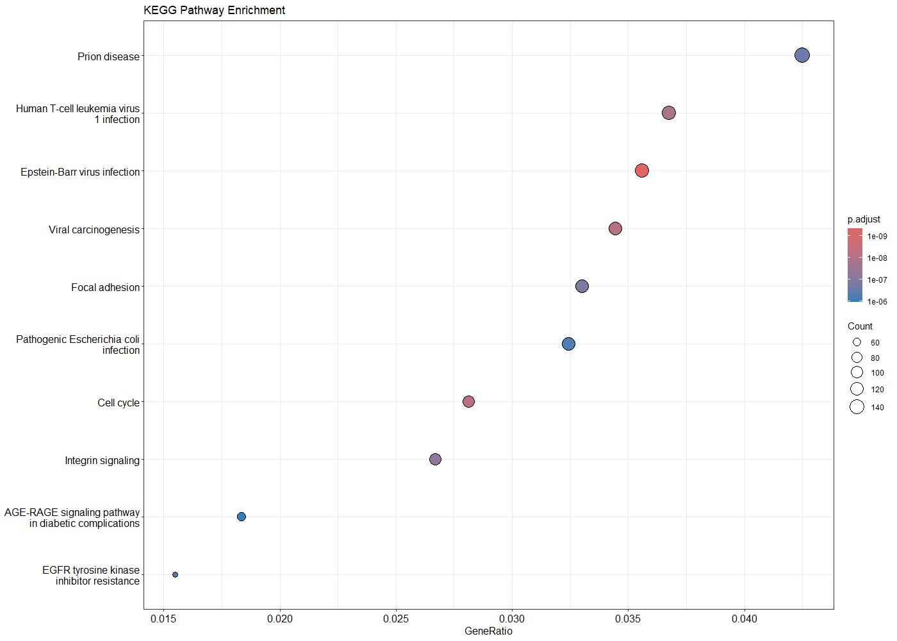

# Case Analysis Transcriptomics – GSE10072

## Analisis Differential Gene Expression pada Lung Adenocarcinoma

---

## Pendahuluan

Kanker paru merupakan salah satu penyebab utama kematian akibat kanker di dunia. Salah satu subtipe yang paling umum adalah lung adenocarcinoma, yang ditandai oleh perubahan ekspresi gen dibandingkan jaringan paru normal. Analisis transcriptomics digunakan untuk mengidentifikasi Differentially Expressed Genes (DEG) serta memahami jalur biologis yang terlibat dalam proses karsinogenesis.

Pada analisis ini digunakan dataset publik GSE10072 dari NCBI Gene Expression Omnibus (GEO) untuk membandingkan profil ekspresi gen antara jaringan paru normal dan jaringan adenokarsinoma paru menggunakan pendekatan bioinformatika berbasis R.

---

## Metode

### Dataset

* Dataset: GSE10072
* Platform: Affymetrix Human Genome U133A (GPL96)
* Organisme: Homo sapiens
* Perbandingan: Normal lung vs Lung adenocarcinoma

### Alur Analisis

1. Pengambilan data menggunakan package GEOquery.
2. Preprocessing data dan transformasi log2.
3. Analisis Differential Expression menggunakan metode limma.
4. Visualisasi volcano plot dan heatmap Top 50 DEG.
5. Analisis enrichment Gene Ontology (GO) dan KEGG Pathway menggunakan clusterProfiler.

### Kriteria DEG

* Adjusted p-value (FDR) < 0.01
* |log2 Fold Change| > 1

---

## Hasil dan Interpretasi

### 1. Gen Upregulation dan Downregulation (Volcano Plot)

Hasil analisis differential expression menggunakan metode limma menunjukkan adanya gen yang mengalami perubahan ekspresi signifikan antara jaringan paru normal dan jaringan lung adenocarcinoma. Gen dengan nilai log2 Fold Change (logFC) lebih besar dari 1 dikategorikan sebagai gen upregulated, sedangkan gen dengan logFC kurang dari −1 dikategorikan sebagai gen downregulated dengan adjusted p-value < 0.01.

Distribusi gen pada volcano plot memperlihatkan adanya kelompok gen signifikan pada kedua sisi grafik. Gen upregulated mencerminkan peningkatan aktivitas transkripsi pada jaringan tumor, sedangkan gen downregulated menunjukkan penurunan fungsi biologis tertentu yang berkaitan dengan jaringan paru normal. Pola ini menunjukkan adanya perubahan regulasi genetik yang berhubungan dengan proses tumorigenesis.

---

### 2. Top 50 Differentially Expressed Genes (Heatmap)

Heatmap yang menampilkan 50 gen diferensial teratas menunjukkan pemisahan klaster yang jelas antara sampel tumor dan sampel normal. Pola ekspresi gen yang konsisten pada masing-masing kelompok menunjukkan bahwa gen-gen tersebut memiliki kontribusi penting dalam membedakan kondisi biologis.

Warna merah pada heatmap menunjukkan tingkat ekspresi gen yang lebih tinggi pada jaringan kanker, sedangkan warna biru menunjukkan ekspresi yang lebih rendah dibandingkan jaringan normal. Klasterisasi ini mendukung hasil analisis statistik bahwa perubahan ekspresi gen bersifat sistematis dan bukan acak.

---

### 3. Analisis Enrichment

#### Gene Ontology (GO)

Analisis Gene Ontology menunjukkan bahwa gen diferensial banyak terlibat dalam proses biologis yang berkaitan dengan siklus sel, pembelahan mitosis, dan replikasi DNA. Jalur-jalur ini berhubungan erat dengan peningkatan proliferasi sel yang merupakan karakteristik utama jaringan kanker paru.

#### KEGG Pathway

Hasil KEGG pathway enrichment mengidentifikasi beberapa jalur penting seperti pathways in cancer, p53 signaling pathway, dan cell cycle pathway. Aktivasi jalur tersebut menunjukkan adanya gangguan mekanisme kontrol pertumbuhan sel serta peningkatan aktivitas proliferatif pada adenokarsinoma paru.

---

## Kesimpulan

Analisis transcriptomics menggunakan dataset GSE10072 berhasil mengidentifikasi gen yang mengalami perubahan ekspresi signifikan antara jaringan paru normal dan adenokarsinoma paru. Visualisasi volcano plot dan heatmap menunjukkan perbedaan pola ekspresi yang jelas, sementara analisis enrichment GO dan KEGG mengungkap keterlibatan jalur biologis yang berkaitan dengan proliferasi sel dan mekanisme kanker.

Pendekatan bioinformatika ini memberikan gambaran mengenai perubahan molekuler pada kanker paru serta potensi kandidat biomarker untuk penelitian lanjutan.

---

## Tools dan Packages

* GEOquery
* limma
* ggplot2
* pheatmap
* clusterProfiler
* org.Hs.eg.db

---

## Author

Nama: Tana Graha
Course: BRSP Transcriptomics
Institusi: IPB University
